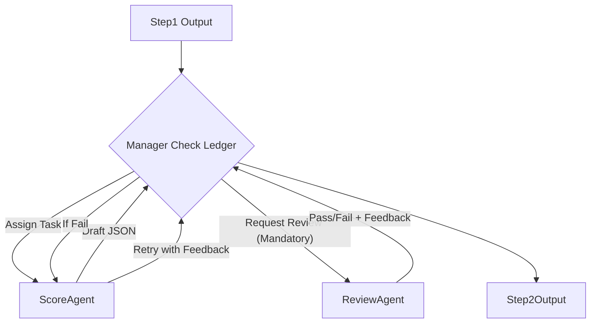

# 股票推荐系统 Step 2 概要设计说明书

## 文档版本信息

| 版本 | 日期 | 作者 | 说明 |
|------|------|------|------|
| v1.0 | 2026-02-04 | Codex | 新增 Step 2 概要设计（评分 + Reviewer） |

---

## 1. 设计概述

Step 2 的目标是基于 Step 1 的结构化输出，给出“推荐持有评分”与“概要原因”。本阶段采用 **MAF Magentic 编排 (MagenticBuilder)**，通过一个智能 Manager 协调评分与审阅过程，实现自动化的质量控制闭环。

核心角色：
- **Manager (Orchestrator)**: MAF 内置智能编排器，负责任务分发和进度管理。
- **评分 Agent (ScoreAgent)**：Participant，启用 API 级结构化输出与**原生联网搜索**，负责生成高可靠性的推荐评分。
- **审阅 Agent (ReviewerAgent)**：Participant，启用 API 级结构化输出，负责逻辑与事实核查。

**技术栈升级**：

- **Orchestration**: `agent_framework.MagenticBuilder`
- **API JSON Mode**: 全面启用 `options={"response_format": {"type": "json_object"}}`
- **Native Search**: Reviewer 可选启用 `options={"extra_body": {"enable_search": True}}`

---

## 2. 输入规范（Step 1 输出）

Step 2 的输入为 Step 1 的完整输出（JSON），即 `Step1Output`。其字段结构以 `docs/analysis_llm/step1_detailed_design.md` 的 **“10. 数据接口规范 (Output JSON Specification)”** 为准。

**核心结构摘要**：
```json
{
  "timestamp": "2026-02-04T05:28:38.359548+00:00",
  "news": {
    "data_type": "news",
    "stock_code": "603080.SH",
    "stock_name": "新疆火炬",
    "news_summary": "过去12个月...（300-800字深度摘要）",
    "sentiment_score": 0.62,
    "positive_news": ["..."],
    "negative_news": ["..."]
  },
  "sector": {
    "data_type": "sector",
    "stock_code": "603080.SH",
    "stock_name": "新疆火炬",
    "heat_index": 72.5,
    "trend": "上升",
    "capital_flow": "主力资金净流入..."
  },
  "kline": {
    "data_type": "kline",
    "stock_code": "603080.SH",
    "trend_analysis": "月K线显示长期底部...",
    "buy_suggestion": "买入",
    "technical_indicators": { "MACD": 1.2, ... }
  }
}
```

**注意**：Step 2 必须完整读取并理解 `news / sector / kline` 的内容（尤其是 `news_summary`、`capital_flow`、`trend_analysis`、`buy_suggestion` 等字段），作为评分与总结的依据。

---

## 3. 输出规范（Step 2 JSON）

Step 2 输出为一个 **严格 JSON 对象**，用于表示“推荐持有评分 + 概要原因”。

### 3.1 字段定义

| 字段 | 类型 | 必填 | 说明 |
|------|------|------|------|
| `data_type` | string | 是 | 固定值：`"hold_recommendation"` |
| `timestamp` | string | 是 | 本次评分生成的当前时间 (UTC ISO 8601) |
| `stock_code` | string | 是 | 必须与输入一致 |
| `stock_name` | string | 是 | 股票名称（**允许空字符串**，不影响后续流程） |
| `hold_score` | float | 是 | 推荐持有评分，范围 0–10 |
| `summary_reason` | string | 是 | 概要原因说明，100-1000 字 |

**生成策略**：
- `data_type` 和 `timestamp` 字段由后端 Python 代码自动填充。
- `stock_name` 采用两层回退：优先使用 `news.stock_name`，若为空则使用 `sector.stock_name`；**若两者都为空，允许留空字符串并记录日志告警**（因为 `stock_code` 是核心标识符，足以完成后续流程）。
- ScoreAgent 仅负责生成 `hold_score` 和 `summary_reason`。

### 3.2 示例输出
```json
{
  "data_type": "hold_recommendation",
  "timestamp": "2026-02-04T12:00:00Z",
  "stock_code": "603080.SH",
  "stock_name": "新疆火炬",
  "hold_score": 7.2,
  "summary_reason": "公司近12个月业绩稳中有升..."
}
```

### 3.3 信任模式说明
Step 2 **无条件信任 Step 1 输出**，不对Step1的输出json进行结构/逻辑校验；在Step2内部会进行自己的校验。


---

## 4. Magentic 编排设计

### 4.1 角色划分

1. **Manager (Magentic Orchestrator)**
   - **类型**: `StandardMagenticManager` (MAF Built-in)
   - **职责**: 强制执行 **生成 -> 审阅 -> (重试)** 的质量闭环流程。**审阅是必经环节**，Manager 不得跳过 Reviewer 直接输出结果。

2. **ScoreAgent（评分 Agent）**
   - **类型**: Participant
   - **配置**: `options={"response_format": {"type": "json_object"}, "extra_body": {"enable_search": True}}`
   - **输入**: 完整 Step1Output JSON
   - **输出**: `hold_score` + `summary_reason` (JSON)

3. **ReviewAgent（Reviewer Agent）**
   - **类型**: Participant
   - **配置**: `options={"response_format": {"type": "json_object"}}`
   - **职责**: **质量守门员**。执行严格的内容与逻辑质检。
   - **权限**: 拥有**一票否决权**。若发现问题，直接返回 `passed: false` 并阻断流程，强制 ScoreAgent 重试。

### 4.2 严格模式与质量闭环

由于启用了 Magentic 编排，系统通过 Reviewer 的反馈实现自动纠错：
- **Pydantic 校验失败**: 后端拦截并报错。
- **Reviewer 否决 (`passed: false`)**: Manager 捕捉信号，将 `reason` 发送给 ScoreAgent 进行重试。
- **循环控制**: 通过设置 Workflow 的 `max_iterations` (建议 10 次，约等于 5 轮 Score-Review 循环) 来防止死循环。若达到上限仍未通过，Manager 将终止任务（或根据框架行为抛出异常）。

---

## 5. 数据模型设计（Step2Output）

```python
class Step2Output(BaseModel):
    data_type: Literal["hold_recommendation"]
    timestamp: str = Field(..., description="生成时间 (UTC ISO 8601)")
    stock_code: str = Field(..., description="股票代码")
    stock_name: str = Field(..., description="股票名称")
    hold_score: float = Field(..., ge=0, le=10, description="推荐持有评分")
    summary_reason: str = Field(..., min_length=100, max_length=1000, description="推荐原因摘要")
```

---

## 6. Prompt 设计

### 6.1 ScoreAgent System Prompt
- **能力开启**: **原生联网搜索**已就绪。若 Step 1 信息不足或过时，请主动搜索补充。
- **输入**: Step1Output JSON
- **评分标准 (Rubric)**：
  - **技术面 (40%)**：趋势向上、支撑有效、指标金叉为加分项。
  - **基本面/新闻 (30%)**：业绩增长、利好公告为加分；重大负面（如造假、违规）为**一票否决**（分数需<6.0）。
  - **板块热度 (30%)**：资金流入、板块效应强为加分项。
- **输出约束**:
  - 严格 JSON，无解释。
  - `summary_reason` 必须详实，字数在 **100-1000 字** 之间。

### 6.2 ReviewAgent System Prompt
- **能力开启**: 强制 JSON 模式。
- **职责**: **拥有否决权的质检**。
- **检查项**:
  1. **逻辑自洽**: 分数与理由的情感倾向必须一致。
  2. **事实准确**: 基于输入审阅。
  3. **完整性**: 理由是否充分支撑了评分。
- **输出格式**: 必须输出纯 JSON 对象，格式如下：
```json
{
    "stock_code": "603080.SH",
    "passed": true,
    "reason": "如果 passed 为 false，请提供具体的修改建议；如果为 true，填空字符串"
}
```


---


## 7. 编排流程示意 (Magentic Pattern)





**说明**：所有流转由 Manager 自动决策，无需手动编写 `if/else` 循环。开发者只需定义“任务目标”和“参与者”。


---

## 8. Agent 与模型配置选型

Step 2 的模型配置独立于 Step 1，需在 `analysis_llm/config.py` 中新增以下配置：
**允许使用多提供商模型（DashScope/DeepSeek），与 Step1 可不同；要求 config.py 中变量名区分。**

| 配置变量名 | 模型 ID | 角色描述 | API 提供商 | 高级特性启用 |
| :--- | :--- | :--- | :--- | :--- |
| `MODEL_MANAGER` | `qwen-plus` | Magentic Manager (决策调度) | 阿里云 (DashScope) | 无 |
| `MODEL_SCORE_AGENT` | `qwen-max` | 评分 Agent (主推理) | 阿里云 (DashScope) | JSON Mode, 原生搜索 |
| `MODEL_REVIEW_AGENT` | `deepseek-chat` | 审阅 Agent (质检核查) | DeepSeek 官方 | JSON Mode |
| `MAX_ITERATIONS` | `10` | Magentic 最大迭代步数 | N/A | 用于控制重试循环上限 |

### 8.1 关键注意事项
1.  **多提供商支持**:
    - 阿里云模型 (`qwen-*`) 使用 `.env` 中的 `DASHSCOPE_API_KEY` 和 `DASHSCOPE_BASE_URL`。
    - DeepSeek 模型 (`deepseek-chat`) 使用 `.env` 中的 `DEEPSEEK_API_KEY` 和 `DEEPSEEK_BASE_URL`。
2.  **高级特性传参**:
    - `MODEL_SCORE_AGENT` 和 `MODEL_REVIEW_AGENT` 必须通过 MAF `options` 参数开启 `response_format={"type": "json_object"}`。
    - `MODEL_SCORE_AGENT` 必须额外开启 `extra_body={"enable_search": True}` 以辅助评分。
    - **传参范式**: 具体实现请严格参考 `docs/analysis_llm/tech_note_maf_dashscope_integration.md`。
3.  **隔离性**: 确保 Step 2 配置名与 Step 1 不冲突，便于独立调优。

---

## 9. 错误处理与日志规范

Step 2 必须严格复用 Step 1 已建立的日志基础设施，保持全模块统一。

- **机制复用**: 所有 Step 2 的 Python 模块（如 `workflow_step2.py`）必须通过调用 `analysis_llm.utils.init_logging()` 来初始化 Logger。
- **日志文件**: 共享输出至 `logs/analysis_llm.log`，实现全链路追踪。
- **级别控制**: 遵循 `config.py` 中的定义：
  - **Console**: `INFO` 级别（仅输出关键进度和最终结果）。
  - **File**: `DEBUG` 级别（记录详细的 Agent 思考过程、Reviewer 建议及重试上下文）。
- **异常捕获**: 在 Workflow 运行层捕获所有未处理异常，记录 Stack Trace 到日志文件，并向 Console 输出友好的错误摘要。

---

## 10. 技术验证与依赖 (Technical Validation)

基于 `docs/tech_note_maf_dashscope_integration.md` 的实测结果（2026-02-04），确认 MAF (python-1.0.0b260130) 支持以下关键特性：

1.  **API 级 JSON Mode**: 通过 `options={"response_format": {"type": "json_object"}}` 可成功激活 DashScope 的强制结构化输出。
2.  **原生联网搜索**: 通过 `options={"extra_body": {"enable_search": True}}` 可成功激活 Qwen 的实时搜索插件。
3.  **Magentic 编排**: 源码确认 `agent_framework.MagenticBuilder` 可用，支持 Manager/Ledger 模式。

**版本要求**: 必须使用 `agent_framework>=1.0.0b260130` 及配套的 `qwen3` 适配层。

---

*文档生成时间：2026-02-04*
