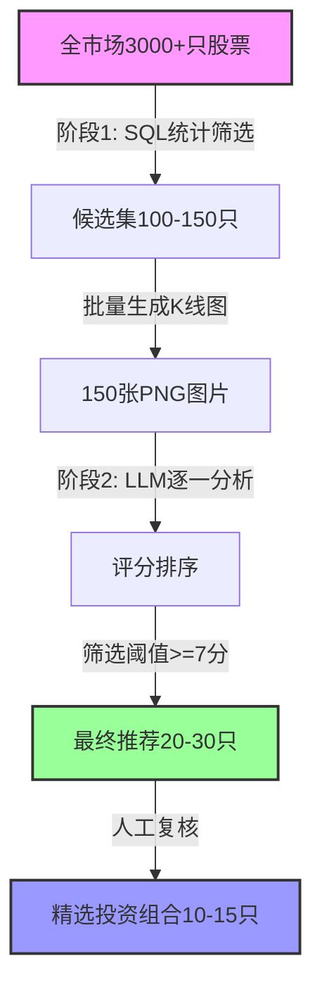

# "平底锅"形态股票智能筛选工具设计文档

## 1. 背景与目标

### 1.1 业务背景

在A股市场中，存在一类特殊形态的股票：
- 历史上曾有过较高涨幅（如2015年牛市期间）
- 随后经历了长期回调，跌幅较大
- 近2-3年在相对稳定的价格区间横盘震荡
- 形态类似"平底锅"：左侧高峰 → 中间下跌 → 右侧横盘

**投资逻辑**：这类股票已经充分消化了前期泡沫，底部盘整时间足够长，具备潜在的上涨空间。这是经典的"底部反转形态"或"圆弧底"的变体。

### 1.2 设计目标

开发一个自动化筛选工具，从全市场（3000+只股票）中快速识别符合"平底锅"形态的候选股票，供投资者进一步分析。

**核心要求**：
- ⚡ **高效性**：全市场扫描耗时 < 10秒（SQL阶段）
- 🎯 **准确性**：准确率 > 85%（LLM精筛后）
- 🧠 **智能化**：利用LLM理解金融形态语义
- 💰 **成本可控**：单次全市场扫描成本 < 100元
- 📊 **可解释**：每个推荐结果都有详细理由

### 1.3 模板参考

基于以下已验证的模板股票：
- 300444.SZ（2015年高点后长期横盘）
- 002823.SZ（典型圆弧底形态）
- 600482.SH（深度回撤后底部震荡）
- 300466.SZ、300516.SZ、601179.SH 等

## 2. 形态特征定义

### 2.1 核心特征

| 序号 | 特征名称 | 计算方法 | 典型阈值 | 金融含义 |
|:---|:---|:---|:---|:---|
| 1 | **历史高点** | 2015-2020年期间的最高价 | > 10元 | 股票曾有过实质性上涨 |
| 2 | **回撤幅度** | (1 - 当前价 / 历史高点) × 100% | 40% ~ 80% | 跌幅足够深，泡沫已释放 |
| 3 | **近期波动率** | 最近24个月收盘价的变异系数 | < 0.35 | 底部震荡幅度小，趋于稳定 |
| 4 | **近期涨幅** | 最近24个月的最大涨幅 | < 50% | 未出现突然暴涨（排除炒作） |
| 5 | **数据完整性** | 2015年以来的数据月数 | ≥ 60个月 | 确保有足够历史数据 |
| 6 | **价格合理性** | 当前股价 | > 3元 | 排除仙股（流动性差、风险高） |
| 7 | **均线收敛** | 5/10/20月均线的粘合程度 | LLM判断 | 波动率降低的视觉确认 |
| 8 | **成交量萎缩** | 底部成交量 vs 高点成交量 | LLM判断 | 抛压释放完毕 |

### 2.2 形态示意

```
价格
 │
 │    ╱╲              典型"平底锅"形态：
 │   ╱  ╲             - 历史高点（峰值）
 │  ╱    ╲            - 下跌通道（消化泡沫）
 │ ╱      ╲___________  - 底部横盘（蓄势待发）
 │╱         ‾‾‾‾‾‾‾‾‾  - 均线收敛（波动收窄）
 └────────────────────> 时间
   2015   2018   2023
```

## 3. 技术方案选型

### 3.1 方案对比

| 方案 | 优点 | 缺点 | 综合评分 |
|:---|:---|:---|:---|
| **SQL统计筛选** | 快速、可解释、易调节 | 难以捕捉复杂形态特征 | ⭐⭐⭐⭐ |
| **LLM多模态分析** | 理解金融语义、高准确率、灵活 | 有API成本 | ⭐⭐⭐⭐⭐ |
| **传统视觉模型** | 可离线运行 | 需大量标注、不可解释 | ⭐⭐⭐ |
| **SQL + LLM组合** | 兼具效率和准确性 | 两阶段流程 | ⭐⭐⭐⭐⭐ |

### 3.2 最终选择

**采用：SQL统计筛选（粗筛）+ LLM多模态分析（精选）**

#### 3.2.1 为什么选择LLM而非传统视觉模型？

| 维度 | LLM多模态 | 传统视觉模型 | 优势方 |
|:---|:---|:---|:---|
| **理解金融概念** | 理解"圆弧底""横盘""均线收敛"等术语 | 只能计算像素相似度 | 🏆 LLM |
| **可解释性** | 输出详细分析理由 | 只能给一个分数 | 🏆 LLM |
| **灵活性** | 修改prompt即可调整标准 | 需重新标注+训练 | 🏆 LLM |
| **多维度分析** | 同时分析K线+均线+成交量 | 仅整体图像特征 | 🏆 LLM |
| **实施成本** | API调用费（$8/100只） | 需GPU训练环境 | 🏆 LLM |
| **准确率** | 85-95% | 75-85% | 🏆 LLM |

**核心优势**：LLM能像人类分析师一样"看图说话"，理解K线图背后的金融含义，而不仅仅是像素匹配。

#### 3.2.2 两阶段筛选流程



**阶段划分**：
1. **阶段1（SQL粗筛）**：3000只 → 100-150只（耗时 < 10秒）
2. **阶段2（LLM精选）**：100-150只 → 20-30只（耗时 5-10分钟，成本 $8-12）
3. **阶段3（人工复核）**：20-30只 → 10-15只（查看图表）

**理由**：
1. SQL快速排除95%的明显不符合的股票（效率优先）
2. LLM精准识别剩余5%中的最优标的（准确率优先）
3. 成本集中在小范围候选集，总成本可控

## 4. 阶段1：SQL统计筛选

### 4.1 核心指标设计

#### 指标1：历史高点 (historical_high)

```sql
MAX(CASE WHEN month BETWEEN '2015-01-01' AND '2020-12-31'
    THEN high END) as historical_high
```

**说明**：选择2015-2020年作为历史高点窗口，覆盖2015年牛市及2018年反弹。

#### 指标2：当前价格 (current_price)

```sql
(SELECT close FROM stock_monthly_kline
 WHERE code = smk.code
 ORDER BY month DESC LIMIT 1) as current_price
```

**说明**：使用子查询获取最新一个月的收盘价。

#### 指标3：回撤幅度 (drawdown_pct)

```sql
(1 - current_price::numeric / NULLIF(historical_high, 0)) * 100 as drawdown_pct
```

**说明**：衡量从历史高点下跌的百分比，值越大表示跌幅越深。

#### 指标4：近期波动率 (recent_volatility)

```sql
STDDEV(CASE WHEN month >= NOW() - INTERVAL '24 months'
       THEN close END)::numeric /
NULLIF(AVG(CASE WHEN month >= NOW() - INTERVAL '24 months'
    THEN close END), 0) as recent_volatility
```

**说明**：使用变异系数（标准差/均值）衡量相对波动性，归一化后可跨股票比较。

#### 指标5：近期涨幅 (recent_range_pct)

```sql
(MAX(CASE WHEN month >= NOW() - INTERVAL '24 months' THEN close END) -
 MIN(CASE WHEN month >= NOW() - INTERVAL '24 months' THEN close END))::numeric /
NULLIF(MIN(CASE WHEN month >= NOW() - INTERVAL '24 months' THEN close END), 0) * 100
as recent_range_pct
```

**说明**：计算最近24个月的最大涨幅，用于排除近期被炒作的股票。

### 4.2 完整SQL查询模板

```sql
WITH stock_features AS (
  SELECT
    code,

    -- 1. 历史高点（2015-2020年）
    MAX(CASE WHEN month BETWEEN '2015-01-01' AND '2020-12-31'
        THEN high END) as historical_high,

    -- 2. 当前价格（最新月份）
    (SELECT close FROM stock_monthly_kline
     WHERE code = smk.code
     ORDER BY month DESC LIMIT 1) as current_price,

    -- 3. 近期波动率（最近24个月）
    STDDEV(CASE WHEN month >= NOW() - INTERVAL '24 months'
           THEN close END)::numeric /
    NULLIF(AVG(CASE WHEN month >= NOW() - INTERVAL '24 months'
        THEN close END), 0) as recent_volatility,

    -- 4. 近期涨幅（最近24个月）
    (MAX(CASE WHEN month >= NOW() - INTERVAL '24 months' THEN close END) -
     MIN(CASE WHEN month >= NOW() - INTERVAL '24 months' THEN close END))::numeric /
    NULLIF(MIN(CASE WHEN month >= NOW() - INTERVAL '24 months' THEN close END), 0) * 100
    as recent_range_pct,

    -- 5. 数据完整性
    COUNT(CASE WHEN month >= '2015-01-01' THEN 1 END) as data_months

  FROM stock_monthly_kline smk
  WHERE month >= '2015-01-01'
  GROUP BY code
)

SELECT
  code,
  ROUND(historical_high::numeric, 2) as hist_high,
  ROUND(current_price::numeric, 2) as curr_price,
  ROUND((1 - current_price::numeric / NULLIF(historical_high, 0)) * 100, 1) as drawdown_pct,
  ROUND(recent_volatility::numeric, 3) as volatility,
  ROUND(recent_range_pct::numeric, 1) as recent_range,
  data_months
FROM stock_features
WHERE
  -- 筛选条件（默认阈值）
  historical_high > 10                                          -- 历史高点有意义
  AND current_price > 3                                         -- 排除仙股
  AND (1 - current_price::numeric / NULLIF(historical_high, 0)) * 100 > 40    -- 回撤 > 40%
  AND recent_volatility < 0.35                                  -- 波动率 < 0.35
  AND recent_range_pct < 50                                     -- 近期涨幅 < 50%
  AND data_months >= 60                                         -- 至少5年数据
ORDER BY drawdown_pct DESC;
```

### 4.3 Python实现（find_flatbottom.py）

```python
import pandas as pd
from load_data.db import get_db_connection
import logging

def sql_screen_candidates(
    min_drawdown: float = 40,
    max_volatility: float = 0.35,
    max_recent_range: float = 50,
    min_data_months: int = 60,
    min_historical_high: float = 10,
    min_current_price: float = 3
) -> pd.DataFrame:
    """
    SQL统计筛选候选股票

    Returns:
        DataFrame with columns: code, hist_high, curr_price, drawdown_pct,
                                volatility, recent_range, data_months
    """
    sql = """
    WITH stock_features AS (
      -- [完整SQL如上所示]
    )
    SELECT ... FROM stock_features WHERE ...
    """

    conn = get_db_connection()
    df = pd.read_sql(sql, conn, params=(
        min_historical_high, min_current_price,
        min_drawdown, max_volatility, max_recent_range, min_data_months
    ))
    conn.close()

    return df
```

## 5. 阶段2：LLM智能分析

### 5.1 核心Prompt设计

```python
ANALYSIS_PROMPT = """
这是一张A股股票的月K线图（2015-2025年），包含：
- 主图：月度K线 + 5/10/20月均线
- 副图：月度成交量

请你作为专业的技术分析师，判断该股票是否符合"平底锅形态"（底部反转形态）：

【标准定义】
1. 历史高点：在2015-2020年期间有明显的价格高点
2. 深度回撤：从历史高点下跌幅度 > 40%
3. 底部横盘：最近2-3年（2022-2024）在相对稳定的价格区间震荡
4. 波动收敛：底部震荡的幅度逐渐减小，均线趋于粘合
5. 成交量萎缩：底部期间成交量相对萎缩（相比历史高点时期）

【评分标准】
- 9-10分：完美符合所有5个特征，强烈推荐
- 7-8分：符合4个特征，值得重点关注
- 5-6分：符合3个特征，可作为备选
- 3-4分：仅符合1-2个特征
- 0-2分：基本不符合

【输出格式】
请严格按照以下JSON格式输出（不要添加```json等标记）：
{
  "score": 8.5,
  "match": true,
  "features": {
    "historical_high": "简述历史高点情况（时间+价格）",
    "drawdown": "回撤幅度百分比",
    "base_period": "底部横盘的时间段和价格区间",
    "convergence": "均线收敛情况描述",
    "volume": "成交量变化特征"
  },
  "risk_alerts": ["风险点1", "风险点2"],
  "recommendation": "一句话总结推荐理由（或不推荐理由）"
}
"""
```

### 5.2 Python实现（llm_scanner.py）

#### 核心类设计

```python
import anthropic
import base64
import json
from pathlib import Path
from typing import Dict, List
import logging

class LLMChartAnalyzer:
    """基于Claude的K线图形态分析器"""

    def __init__(self, api_key: str = None):
        self.client = anthropic.Anthropic(api_key=api_key)
        self.model = "claude-3-5-sonnet-20241022"
        self.logger = logging.getLogger(__name__)

    def analyze_chart(self, chart_path: str, code: str) -> Dict:
        """
        分析单张K线图

        Args:
            chart_path: K线图文件路径
            code: 股票代码

        Returns:
            {
                'code': '600000.SH',
                'score': 8.5,
                'match': True,
                'features': {...},
                'risk_alerts': [...],
                'recommendation': '...'
            }
        """
        # 读取图片并转为base64
        with open(chart_path, 'rb') as f:
            chart_data = base64.standard_b64encode(f.read()).decode('utf-8')

        try:
            message = self.client.messages.create(
                model=self.model,
                max_tokens=2048,
                temperature=0.3,  # 降低温度提高确定性
                messages=[{
                    "role": "user",
                    "content": [
                        {
                            "type": "image",
                            "source": {
                                "type": "base64",
                                "media_type": "image/png",
                                "data": chart_data
                            }
                        },
                        {
                            "type": "text",
                            "text": self._get_analysis_prompt()
                        }
                    ]
                }]
            )

            # 解析JSON响应
            response_text = message.content[0].text.strip()

            # 清理可能的markdown代码块标记
            if response_text.startswith('```'):
                lines = response_text.split('\n')
                response_text = '\n'.join(lines[1:-1])

            result = json.loads(response_text)
            result['code'] = code
            result['chart_path'] = chart_path

            self.logger.info(f"{code}: Score={result['score']}, Match={result['match']}")
            return result

        except Exception as e:
            self.logger.error(f"Error analyzing {code}: {e}")
            return {
                'code': code,
                'score': 0,
                'match': False,
                'error': str(e)
            }

    def batch_analyze(
        self,
        chart_paths: List[str],
        output_csv: str = None,
        min_score: float = 0
    ) -> List[Dict]:
        """
        批量分析K线图

        Args:
            chart_paths: K线图文件路径列表
            output_csv: 结果保存路径（可选）
            min_score: 最低评分阈值，低于此分数的不返回

        Returns:
            分析结果列表（按评分降序排序）
        """
        results = []
        total = len(chart_paths)

        self.logger.info(f"开始批量分析 {total} 张K线图...")

        for i, chart_path in enumerate(chart_paths, 1):
            # 从文件名提取股票代码
            code = Path(chart_path).stem.replace('_kline', '')

            self.logger.info(f"[{i}/{total}] 分析 {code}...")
            result = self.analyze_chart(chart_path, code)

            # 过滤低分股票
            if result.get('score', 0) >= min_score:
                results.append(result)

        # 按评分降序排序
        results.sort(key=lambda x: x.get('score', 0), reverse=True)

        # 保存为CSV（可选）
        if output_csv:
            self._save_to_csv(results, output_csv)

        return results

    def _save_to_csv(self, results: List[Dict], output_path: str):
        """保存结果为CSV"""
        import pandas as pd

        df = pd.DataFrame([{
            'code': r['code'],
            'score': r.get('score', 0),
            'match': r.get('match', False),
            'recommendation': r.get('recommendation', ''),
            'risk_alerts': '; '.join(r.get('risk_alerts', []))
        } for r in results])

        df.to_csv(output_path, index=False, encoding='utf-8-sig')
        self.logger.info(f"结果已保存到 {output_path}")

    def _get_analysis_prompt(self) -> str:
        """获取分析提示词"""
        return ANALYSIS_PROMPT  # 如5.1节定义
```

#### CLI命令行工具

```python
def main():
    """主函数"""
    import argparse
    import os

    parser = argparse.ArgumentParser(description='LLM智能K线图分析器')
    parser.add_argument('--charts-dir', default='output', help='K线图所在目录')
    parser.add_argument('--output', default='output/llm_analysis.csv', help='结果保存路径')
    parser.add_argument('--min-score', type=float, default=7.0, help='最低评分阈值')
    parser.add_argument('--limit', type=int, help='最多分析N张图（控制成本）')
    args = parser.parse_args()

    # 初始化分析器
    api_key = os.getenv('ANTHROPIC_API_KEY')
    if not api_key:
        logger.error("请设置环境变量 ANTHROPIC_API_KEY")
        return

    analyzer = LLMChartAnalyzer(api_key=api_key)

    # 获取所有K线图
    chart_paths = list(Path(args.charts_dir).glob('*_kline.png'))

    if args.limit:
        chart_paths = chart_paths[:args.limit]

    logger.info(f"找到 {len(chart_paths)} 张K线图")

    # 批量分析
    results = analyzer.batch_analyze(
        [str(p) for p in chart_paths],
        output_csv=args.output,
        min_score=args.min_score
    )

    # 打印摘要
    print(f"\n{'='*60}")
    print(f"分析完成！共 {len(results)} 只高分股票（>= {args.min_score}分）")
    print(f"{'='*60}\n")

    # 打印Top 10
    print("Top 10 推荐股票：\n")
    for i, r in enumerate(results[:10], 1):
        print(f"{i}. {r['code']} - 评分: {r.get('score', 0)}/10")
        print(f"   {r.get('recommendation', 'N/A')}\n")

if __name__ == "__main__":
    main()
```

### 5.3 成本估算

#### Claude 3.5 Sonnet定价（2026年1月）

- 图片输入：$0.48 per 1000 tokens
- 文本输出：$1.5 per 1000 tokens
- 每张K线图（~100KB）：约85 tokens

**单张图片分析成本**：
- 输入：85 tokens × $0.48/1000 = **$0.041**
- 输出（~500 tokens）：500 × $1.5/1000 = **$0.75**
- **合计：约 $0.08/张（0.58元人民币）**

**批量分析成本**：
| 股票数量 | 成本（美元） | 成本（人民币） |
|:---|:---|:---|
| 50只 | $4 | ¥29 |
| 100只 | $8 | ¥58 |
| 150只 | $12 | ¥87 |
| 200只 | $16 | ¥116 |

✅ **对个人投资者完全可承受！**

## 6. 完整工作流程

### 6.1 流程图

```
步骤1: SQL粗筛
  ├─ 输入：全市场3000+只股票
  ├─ 处理：执行SQL统计筛选
  ├─ 输出：100-150只候选股票
  └─ 耗时：< 10秒

步骤2: 批量生成K线图
  ├─ 输入：100-150只股票代码
  ├─ 处理：调用 plot_kline.py
  ├─ 输出：100-150张PNG图片
  └─ 耗时：2-5分钟

步骤3: LLM智能分析
  ├─ 输入：100-150张K线图
  ├─ 处理：逐一调用Claude API
  ├─ 输出：评分排序的CSV报告
  └─ 耗时：5-10分钟，成本$8-12

步骤4: 人工复核
  ├─ 输入：Top 20-30只高分股票
  ├─ 处理：查看图表+基本面研究
  ├─ 输出：最终投资组合10-15只
  └─ 耗时：30-60分钟
```

### 6.2 命令行操作示例

```bash
# ============================================
# 完整筛选流程
# ============================================

# 步骤1：SQL粗筛（输出候选股票列表）
python -m visualization.find_flatbottom \
  --min-drawdown 40 \
  --max-volatility 0.35 \
  --max-range 50 \
  --export-csv output/sql_candidates.csv

# 查看SQL筛选结果
head output/sql_candidates.csv

# 步骤2：批量生成K线图（假设筛选出150只）
cat output/sql_candidates.csv | tail -n +2 | cut -d',' -f1 | while read code; do
  python -m visualization.plot_kline "$code" --start 2015-01-01
done

# 步骤3：LLM智能分析
export ANTHROPIC_API_KEY="your-api-key"

python -m visualization.llm_scanner \
  --charts-dir output \
  --output output/llm_analysis.csv \
  --min-score 7.0 \
  --limit 150  # 分析所有候选股票

# 步骤4：查看最终结果
cat output/llm_analysis.csv | head -20

# 步骤5：（可选）只对Top 30再次生成优化版K线图
cat output/llm_analysis.csv | tail -n +2 | head -30 | cut -d',' -f1 | while read code; do
  python -m visualization.plot_kline "$code" --start 2020-01-01
done
```

### 6.3 成本控制策略

#### 策略1：分批分析（推荐）

```bash
# 先分析前50只（成本$4），验证效果
python -m visualization.llm_scanner --limit 50

# 如果效果好，再分析剩余100只（成本$8）
python -m visualization.llm_scanner --skip 50 --limit 100
```

#### 策略2：设置缓存

```python
# 已分析过的股票缓存结果，避免重复付费
cache_file = 'output/llm_cache.json'
if code in cache:
    return cache[code]
else:
    result = llm_analyze(code)
    cache[code] = result
```

## 7. 参数调优指南

### 7.1 SQL筛选参数

| 参数 | 增大 → 效果 | 减小 → 效果 | 推荐范围 |
|:---|:---|:---|:---|
| `min_drawdown` | 候选股票减少，回撤更深 | 候选股票增多 | 30% ~ 60% |
| `max_volatility` | 候选股票增多，可能包含剧烈震荡 | 候选股票减少，更稳定 | 0.25 ~ 0.40 |
| `max_recent_range` | 候选股票增多，可能包含炒作股 | 候选股票减少，更保守 | 30% ~ 60% |

### 7.2 LLM分析参数

| 参数 | 说明 | 推荐值 |
|:---|:---|:---|
| `min_score` | 最低评分阈值，低于此分数不返回 | 7.0 |
| `temperature` | LLM温度参数，越低越确定性 | 0.3 |
| `max_tokens` | 输出Token上限 | 2048 |

### 7.3 不同市场环境的参数建议

#### 牛市初期（适度进取）
```python
sql_params = {
    'min_drawdown': 30,      # 降低回撤要求
    'max_volatility': 0.40,  # 容忍更高波动
    'max_recent_range': 60   # 允许一定上涨
}
llm_params = {
    'min_score': 6.5         # 降低评分门槛
}
```

#### 震荡市（稳健配置）
```python
sql_params = {
    'min_drawdown': 40,
    'max_volatility': 0.35,
    'max_recent_range': 50
}
llm_params = {
    'min_score': 7.0
}
```

#### 熊市/高风险期（极度保守）
```python
sql_params = {
    'min_drawdown': 50,
    'max_volatility': 0.30,
    'max_recent_range': 40
}
llm_params = {
    'min_score': 8.0         # 只要高分股票
}
```

## 8. 输出与报告

### 8.1 LLM分析报告示例

```json
{
  "code": "300444.SZ",
  "score": 8.5,
  "match": true,
  "features": {
    "historical_high": "2015年4月达到历史高点26.8元",
    "drawdown": "回撤约70%，当前价格8.2元",
    "base_period": "2021年至今在7-10元区间横盘震荡，时长约4年",
    "convergence": "5/10/20月均线在2023年后趋于粘合，显示波动率收敛",
    "volume": "底部成交量明显萎缩至高点时期的30%，抛压释放充分"
  },
  "risk_alerts": [
    "需确认公司基本面是否有实质性改善",
    "关注所属行业景气度变化",
    "注意突破箱体顶部时的成交量配合"
  ],
  "recommendation": "该股票呈现标准的'平底锅'形态，底部盘整时间充分（4年），均线系统收敛明显，技术面评分8.5分，建议纳入重点关注池。"
}
```

### 8.2 CSV汇总报告格式

| code | score | match | recommendation | risk_alerts |
|:---|:---|:---|:---|:---|
| 300444.SZ | 8.5 | true | 标准平底锅形态，强烈推荐 | 需确认基本面；关注行业景气度 |
| 002823.SZ | 8.2 | true | 典型圆弧底，底部扎实 | 注意突破时成交量 |
| 600482.SH | 7.8 | true | 深度回撤后横盘，值得关注 | 横盘时间较短，需观察 |

## 9. 扩展功能设计

### 9.1 Phase 2: 基本面集成（可选）

如果有财务数据API，可在LLM分析中加入：

```python
def comprehensive_analysis(code, chart_path, financial_data):
    """
    综合技术面+基本面分析
    """
    prompt = f"""
    请综合以下信息评估 {code}：

    1. 技术形态：[K线图附上]
    2. 财务数据：
       - 净利润（最近一年）：{financial_data['net_profit']}
       - 资产负债率：{financial_data['debt_ratio']}
       - ROE：{financial_data['roe']}
    3. 行业地位：{financial_data['industry']}

    请给出：
    - 技术面评分（0-10）
    - 基本面评分（0-10）
    - 综合推荐度（买入/持有/观望）
    """
```

### 9.2 Phase 3: 定时自动扫描

```bash
# Cron定时任务（每周一早上9点执行）
0 9 * * 1 cd /opt/fin_analysis && python -m visualization.weekly_scan.py
```

```python
# weekly_scan.py
def weekly_scan():
    """每周定时扫描"""
    # 1. SQL筛选
    candidates = sql_screen_candidates()

    # 2. 批量生成图表
    generate_charts(candidates)

    # 3. LLM分析
    results = llm_analyze(candidates, min_score=7.5)

    # 4. 发送邮件/微信通知
    send_notification(results[:10])
```

## 10. 风险提示

### 10.1 技术分析的局限性

- ⚠️ **历史不代表未来**：形态符合不代表一定上涨
- ⚠️ **基本面风险**：需结合公司财务状况、行业前景分析
- ⚠️ **流动性风险**：部分股票可能因成交量低而难以买卖
- ⚠️ **系统性风险**：市场整体下跌时，个股难以独善其身

### 10.2 LLM使用注意事项

- ⚠️ **非确定性**：同一张图多次分析可能有微小差异（可通过降低temperature缓解）
- ⚠️ **成本控制**：大规模使用需监控API费用
- ⚠️ **API稳定性**：依赖第三方服务，需处理网络异常
- ⚠️ **结果验证**：LLM评分应作为参考，最终决策需人工判断

### 10.3 使用建议

1. **分散投资**：不要重仓单一股票
2. **设置止损**：跌破关键支撑位及时止损
3. **长期持有**：底部形态需要时间孕育，避免频繁交易
4. **定期复盘**：每月/季度重新筛选，动态调整持仓
5. **结合基本面**：技术面筛选后，务必研究公司基本面

## 11. 实现计划

### Phase 1: 核心功能（预计2-3天）
- [x] 设计文档编写
- [ ] 实现 `find_flatbottom.py`（SQL筛选）
- [ ] 实现 `llm_scanner.py`（LLM分析）
- [ ] 完成单元测试
- [ ] 使用模板股票验证效果

### Phase 2: 优化与增强（预计1-2天）
- [ ] 添加结果缓存机制（避免重复付费）
- [ ] 优化输出格式（彩色终端输出、进度条）
- [ ] 实现批量绘图辅助工具
- [ ] 编写详细使用文档

### Phase 3: 扩展功能（可选）
- [ ] 集成基本面数据过滤
- [ ] 开发Web可视化界面
- [ ] 实现定时自动扫描
- [ ] 添加邮件/微信推送通知

---

## 附录

### A. 依赖安装

```bash
# Python依赖
uv add anthropic pandas mplfinance

# 环境变量配置
export ANTHROPIC_API_KEY="your-api-key-here"
```

### B. 快速开始

```bash
# 1. SQL筛选
python -m visualization.find_flatbottom --export-csv output/candidates.csv

# 2. 批量生成K线图（假设50只）
head -50 output/candidates.csv | tail -n +2 | cut -d',' -f1 | while read code; do
  python -m visualization.plot_kline "$code" --start 2015-01-01
done

# 3. LLM分析
python -m visualization.llm_scanner --limit 50 --min-score 7.0
```

### C. 故障排查

| 问题 | 原因 | 解决方案 |
|:---|:---|:---|
| API调用失败 | 网络问题或API Key无效 | 检查网络，验证ANTHROPIC_API_KEY |
| JSON解析错误 | LLM输出格式不符 | 检查prompt，增加格式约束 |
| 成本超预算 | 分析股票数量过多 | 使用--limit参数控制 |
| 图表生成失败 | 数据不存在 | 检查stock_monthly_kline表 |

---

**文档版本**: v2.0 (LLM Integration)
**最后更新**: 2026-01-26
**作者**: Claude + User
